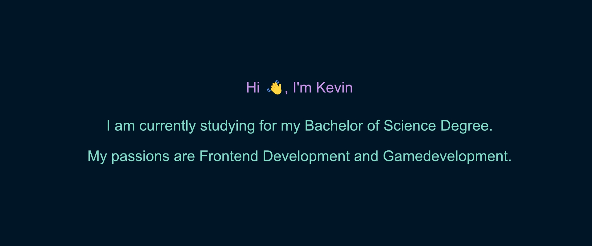

<!--
Used this GitHub Profil Generator and modified it
https://rahuldkjain.github.io/gh-profile-readme-generator/
-->

<h2 align="center">Skills</h2>

<h4 align="left">Programming Languages</h4>

---

  

<h4 align="left">Frontend Development</h4>

---

   

<h4 align="left">DevOps</h4>

---

<h4 align="left">Software</h4>

---

   

<h4 align="left">Game Engines</h4>

---

<h4 align="left">Other</h4>

---

<!--

<h4 align="left">Backend Development</h4>

---

<h4 align="left">Mobile App Development</h4>

---

<h4 align="left">AI/ML</h4>

---

<h4 align="left">Database</h4>

---

<h4 align="left">Data Visualization</h4>

---

<h4 align="left">Backend as a Service (BaaS)</h4>

---

<h4 align="left">Framework</h4>

---

<h4 align="left">Testing</h4>

---

<h4 align="left">Static Site Generators</h4>

---

-->